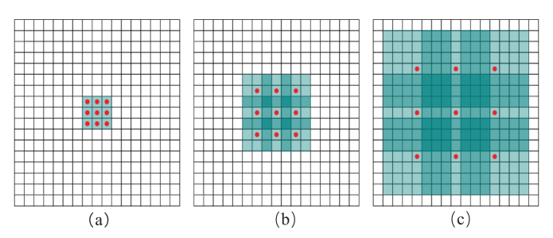
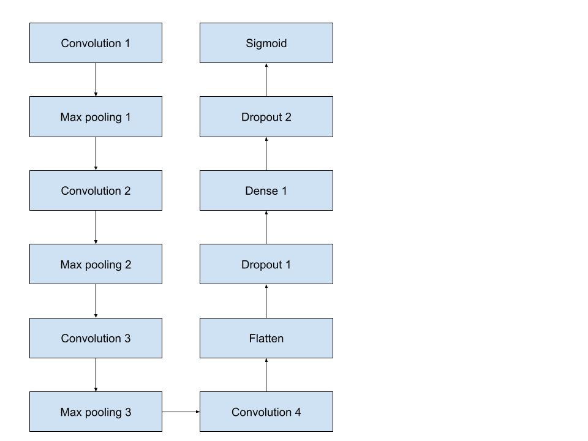
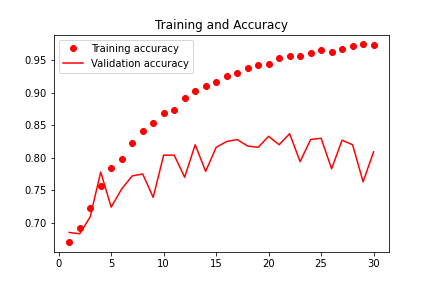
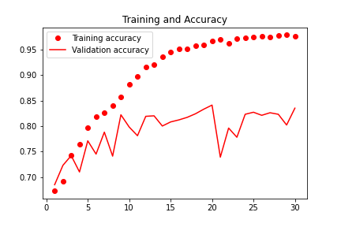
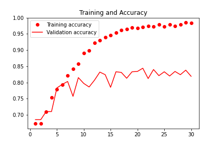
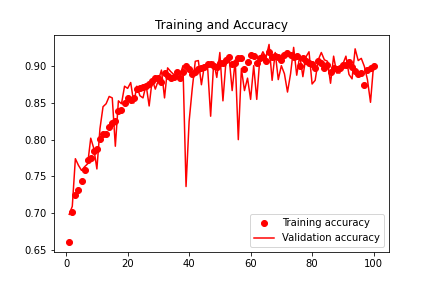
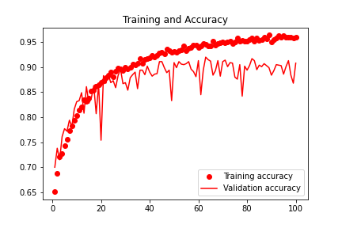
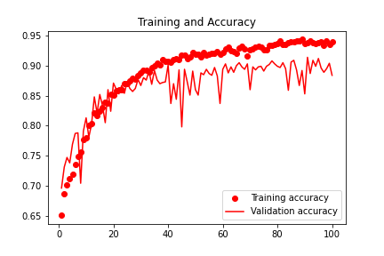

# Dilated CNN model for Image Classification

## Introduction

Convolution neural network (CNN) is a popular method on image classification, and there are different researches to try to improve the performance of CNN. Commonly, CNN layers use the convolutions kernel to output feature maps. [1] stated dilated convolution kernels are able to improve the image classification performance. In the project, I evaluate the dilated convolution kernels on CNN, and compare the result of the dilated CNN model and traditional CNN model. The project performs CNN image classification with cats and dogs image.The objective of the project is to test and compare the result of traditional CNN, dilated CNN, and hybrid dilated CNN (HDC) with my own implementation.

Fig. 1 shows the dilated convolution kernel and traditional convolution kernel. The dilation rate determines the size of the gaps. (a) is a traditional convolution kernel of size 3 ∗ 3, a hole (a point with weight of 0, dilated rate = 1) is inserted around each point in the matrix. (b) is dilated convolution kernel with 2 hole and (c) is dilated convolution kernel with 4. The receptive fieldof the convolution kernel in (a) is 3 ∗ 3, in (b) is 7 ∗ 7, and in (c) is 15∗15. The size of the receptive field increases with the increase of the number of inserted hole, however, the number of parameters in (a), (b) and (c) are still the same.

Fig. 1 the dilated convolution kernel and traditional convolution kernel

## Literature Review

[1] mentions there are many researches focusing on improving image classification methods and increasing the accuracy, and the consumption of computing resources and the reduction of efficiency cannot be overlooked. The researchers propose the dilated convolution kernel can improve the image classification performance without increasing the complexity. Dilated convolution is generally used in image semantic segmentation. It expands the convolution kernel by inserting holes between its consecutive elements. The researchers implement three types of models: traditional CNN (CNN with traditional convolution kernels in each layer), dilated CNN(CNN with dilated convolution kernels and same dilation rates in each layer), and HDC model(hybrid dilated CNN, CNN with dilated convolution kernels and different dilation rates in each layer). As a result, dilated CNN model and HDC model have obvious time required improvement compared with traditional CNN model and HDC models also have highest accuracy. The dilated CNN models have the same accuracy as traditional CNN models and researchers provided two reasons for this. One reason is the dilated convolution kernel causes the loss of the pixel that contains continuity information. Second reason is the fixed kernel size rate causing the large and small size information cannot be taken into account simultaneously when extracting the image feature map.

## Implementation/ Method

The project use the image from the Oxford-IIIT Pet Dataset. The dataset contains 7390 images with 4990 dog images, and 2400 cat images. There will be 2 parts of the project. The first part is to aiming to have the similar models structure as [1] designed and comparing the result of traditional CNN, dilated CNN , HDC models.

The second part of the project tests if the dilated convolution kernels are able to help us on finding the best model. The second part applies data argument and image sclaing in the CNN model and dilated CNN model. Although the [1] doesn't apply data argument and image scaleing steps, both steps are significantly increasing the performance of CNN model. Therefore, I include both steps to find the best performance models.

In Fig 2 , [1] apply the traditional CNN model structure on classify Mnist data set. The structure contains 2 convolution-pooling layers, 2 fully connection layers, and 2 dropout layers.
![Traditional CNN model structure on classify Mnist data set in Lei"s Research [1]](image.png)
Fig. 2 Traditional CNN model structure on classify Mnist data set in Lei"s Research [1]

To approach a similar set up environment, I used the similar model structure in the project. In my cnn model, my cnn model contains 4 convolution-pooling layers, 2 fully connection layers, and 2 dropout layers. The reason I added 2 more convolution-pooling layers is it provides better performance (with 10% accuracy increase and same loss).

Fig 2 The structure of CNN model.

There are two type of dilated models test in [1]. One model uses the same dilated rate, and the other uses the different dilated rate. I also created the models for testing. One dilated CNN model is use dilated rate 2 in the convolution layer. The other dilated CNN model use 1, 2 dilated rate in the convolution layer.

## Results

In part 1, the traditional CNN model has 1.9 millions parameter in the first fully connected network, the dilated CNN and HDC have around 1.3 millions parameter. In the results, all the models have high accuracy and low loss in the range of 5 - 8 epoch. After 10 episodes, the validation loss of the model is getting smaller and starts overfitting. There is no obvious difference between the CNN, dilated CNN, and HDC models.

Fig 3 - epoches vs accuaacy in CNN model

Fig 4 - epoches vs accuaacy in dilated_CNN model

Fig 5 - epoches vs accuaacy in HDC model

In part 2 results, I add data augmentation and rescaling layers to each model, and I train with 100 epochs to see the overall performance with all models. The traditional CNN model loss and accuracy become inconsistent. The differences between each epoch are huge. The training loss reaches the minimum value at 20 epoches. The dilated CNN model with the same dilated rate in each CNN layer has more consistent loss and accuracy compared with the traditional CNN model. The training loss also reached the minimum value at 20 epoches. However, the model's accuracy dropped from 85% to 75% at the 20 epoches. The accuracy drop may be caused by the dilated convolution kernels affecting the omission of some pixels.
The HDC model with different dilated rates has the most consistent loss and accuracy. The training loss also reaches the minimum value at 20 epoches, and has 85% accuracy. All results can see as plots folder with file name starting with(100epochs).

Fig 6 - 100 epoches vs accuaacy in CNN model

Fig 7 - 100 epoches vs accuaacy in dilated_CNN model

Fig 8 - 100 epoches vs accuaacy in HDC model

After that, I used the earlystopping callback to try to get the best performance and test with the test data. The traditional CNN have worst test accuracy comparing to dilated CNN and HDC models. Dilated convolution have increasing the performance of CNN.

|                     | CNN | Dilated CNN | HDC   |
| ------------------- | --- | ----------- | ----- |
| Epochs              | 7   | 7           | 30    |
| Training accuracy   | 86% | 87%         | 89%   |
| Validation accuracy | 88% | 83%         | 83%   |
| Testing accuracy    | 78% | 88%         | 88.2% |

There are some potential issues that affect the result that doesn't have the similar result as [1]. The size of the image, different image objects, and the unknown parameter value for the model structure may be the factor that causes the result to be skewed and not to be expected.

## REFERENCES

[1]. X. Lei, H. Pan and X. Huang, "A Dilated CNN Model for Image Classification," in IEEE Access, vol. 7, pp. 124087-124095, 2019, doi: 10.1109/ACCESS.2019.2927169.
